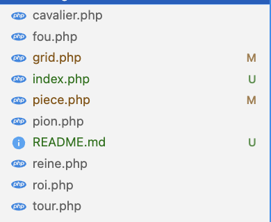
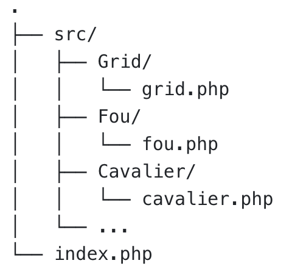

# Principe SOLID

## S : Single Responsibility Principle (SRP)

J'ai modifier l'architecture de mon projet, ce qui permet de lancer tout le programme est fait dans un fichier index.php au lieu de grid, ce qui fait plus sens.

Je suis également passé de cette achitecture

A celle-ci

Le code n'a pas bouger car chaque fichier ne contenait déjà que les méthodes lié à la fonction de la classe.
Toutefois j'ai modifier l'architecture comme ci-dessus afin de mieux organiser les fichiers, si à l'avenir d'autre fichier en lien avec la grille de jeu par exemple, devait être créé.
