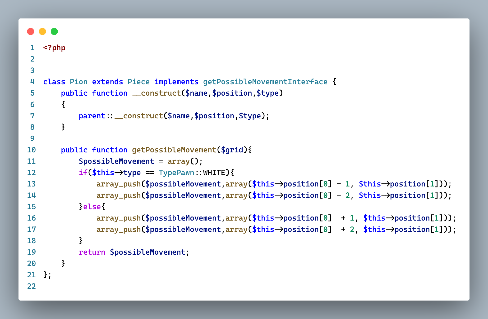

# Principe SOLID

## S : Single Responsibility Principle (SRP)

J'ai modifier l'architecture de mon projet, ce qui permet de lancer tout le programme est fait dans un fichier index.php au lieu de grid, ce qui fait plus sens.

Je suis également passé de cette achitecture

A celle-ci

Le code n'a pas bouger car chaque fichier ne contenait déjà que les méthodes lié à la fonction de la classe.
Toutefois j'ai modifier l'architecture comme ci-dessus afin de mieux organiser les fichiers, si à l'avenir d'autre fichier en lien avec la grille de jeu par exemple, devait être créé.

---

## O : Open/Closed Principle

Avant chacune des pièces de mon échéquier `extend` la classe `Piece`. Je voulais qe chacune de mes pièces aient une méthode `getPossibleMovement`. Au lieu de créer une interface que j'implémente pour chacune de mes pièces, j'avais créer cette méthode directement dans ma classe `Piece` avec un corps vide. J'ai donc modifier cela.

Désormais chaque pièce (Roi, fou, etc.) implémente l'interface `PossibleMovementInterface` pour avoir accès à la méthode.
J'ai également retirer le bout de code suivant de la classe `Piece` puisqu'il n'est plus utile :

    // Methods
    public function getPossibleMovement($grid){}

Voici à quoi ressemble la classe `Pion` désormais

---
